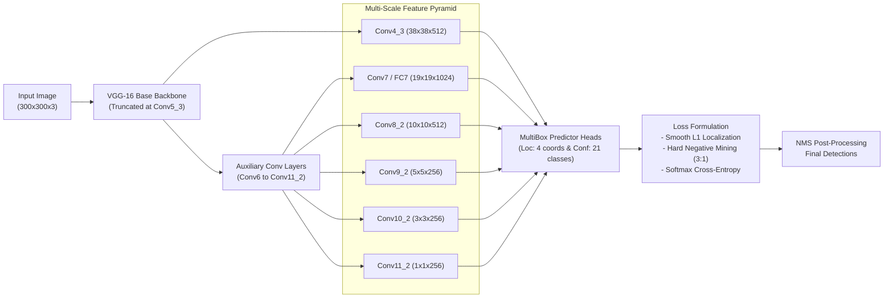

# Single Shot MultiBox Detector (SSD300) from Scratch in PyTorch

[](https://pytorch.org/)
[](https://medium.com/@dheerajkumarmaradana/ssd-single-shot-multibox-detector-d7d570bbbe6f)
[](https://arxiv.org/abs/1512.02325)
[](http://host.robots.ox.ac.uk/pascal/VOC/voc2007/)
[](https://github.com/dheerajkumar2005)

> 📖 **Accompanying Technical Article**: Read the deep-dive architectural walkthrough on Medium:  
> [**SSD: Single Shot MultiBox Detector Explained** by Dheeraj Kumar Maradana](https://medium.com/@dheerajkumarmaradana/ssd-single-shot-multibox-detector-d7d570bbbe6f)

---

## 📌 Overview

This repository provides a modular, clean **PyTorch implementation of the SSD300 (Single Shot MultiBox Detector)** object detection architecture from scratch, trained and evaluated on the **PASCAL VOC 2007** benchmark.

Unlike two-stage detectors (e.g., Faster R-CNN) that utilize separate Region Proposal Networks (RPN), SSD achieves high inference speed by predicting bounding box offsets and category scores directly across multi-scale feature maps in a single feed-forward pass.

---

## 🏗️ Architecture & Pipeline



### Key Technical Elements:
1. **Multi-Scale Detection**: 6 distinct feature map scales ranging from high-resolution shallow layers ($38 \times 38$ for small objects) down to coarse semantic layers ($1 \times 1$ for large objects).
2. **Default Box Generators**: Configured with aspect ratios $\{1:1, 1:2, 2:1, 1:3, 3:1\}$ and scale ratios $s_k$ according to the original formulation.
3. **Hard Negative Mining (3:1)**: Eliminates severe foreground-background class imbalance by selecting only the highest-loss background negative samples in a 3:1 ratio to matched positives.
4. **MultiBox Objective Loss**:
   $$\mathcal{L}(x, c, l, g) = \frac{1}{N} \left( \mathcal{L}_{\text{conf}}(x, c) + \alpha \, \mathcal{L}_{\text{loc}}(x, l, g) \right)$$

---

## 📁 Repository Structure

```
├── ssd_from_scratch.py        # Complete scratch implementation of SSD300 model & MultiBoxLoss
├── train_voc.py               # Custom training harness on Pascal VOC 2007 (SGD with warmup)
├── train_voc_torchvision.py   # Comparative training harness using TorchVision's reference SSD
├── test_voc.py                # mAP evaluation and qualitative visualization engine
├── utils.py                   # Default box matching, IoU computation, NMS, and VOC dataloaders
├── ssd_orig.py                # Structural reference comparison
└── 1512.02325v5.pdf           # Original Liu et al. research paper
```

---

## 🚀 Getting Started

### 1. Dataset Setup (Pascal VOC 2007)
```bash
# Download VOC 2007 trainval and test splits
wget http://host.robots.ox.ac.uk/pascal/VOC/voc2007/VOCtrainval_06-Nov-2007.tar
wget http://host.robots.ox.ac.uk/pascal/VOC/voc2007/VOCtest_06-Nov-2007.tar

# Extract archives
tar -xf VOCtrainval_06-Nov-2007.tar
tar -xf VOCtest_06-Nov-2007.tar
# Extracted data is available at VOCdevkit/VOC2007/
```

### 2. Training
```bash
# Train the from-scratch implementation
python3 train_voc.py

# Or train the TorchVision reference baseline for comparison
python3 train_voc_torchvision.py
```

### 3. Evaluation & Visualization
```bash
# Evaluate scratch model mAP on test split
python3 test_voc.py --checkpoint checkpoints/ssd_best.pth

# Evaluate TorchVision model
python3 test_voc.py --checkpoint checkpoints_tv/ssd_best.pth --torchvision

# Save visual predictions with bounding boxes
python3 test_voc.py --checkpoint checkpoints/ssd_best.pth --save-vis --num-vis 50
```

---

## 📚 References & Attribution

* **Paper**: Liu, W., Anguelov, D., Erhan, D., Szegedy, C., Reed, S., Fu, C. Y., & Berg, A. C. (2016). *SSD: Single shot multibox detector*. ECCV 2016.
* **Author**: Dheeraj Kumar Maradana ([IIT Bombay](https://www.iitb.ac.in/))
